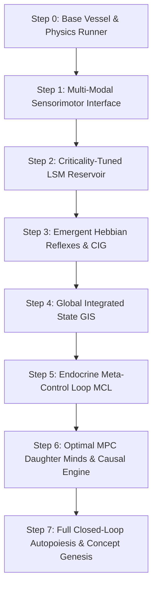

# EBCA MASTER ROADMAP: EMBODIED BIOLOGICAL COGNITIVE ARCHITECTURE
### Integrating CARL-Ω, the GENESIS Manifest, and Constraint-Driven Computational Ecology
**Author:** Manas + Antigravity  
**Workspace:** `D:\ebca\`  
**Date:** July 2026  

---

## EXECUTIVE SYNTHESIS & CORE PHILOSOPHY

> *"We set up the physics. We set up the chemistry. We light the match. What catches fire is up to CARL."*  
> — *GENESIS Manifest*

> *"Learning reduces prediction error to near zero, but stability still depends on decision-making under constraints."*  
> — *Optimal MPC Formulation*

> *"Classical optimization finds a single 'best' design. The feasible region mapping approach maps the entire feasible region and learns its structure across multiple sessions... It is not just an algorithm. It is a learning computational organism."*  

**EBCA (Embodied Biological Cognitive Architecture)** unites three monumental frameworks into a single bottom-up synthetic lifeform:
1. **CARL-Ω (The 8-Layer Cognitive Stack):** An emergent biological hierarchy spanning raw physics, endocrine neuromodulators, hippocampal GPS, holographic memory, causal reasoning, hallucination/free-energy prediction, and concept genesis.
2. **GENESIS Manifest (Autopoiesis & Criticality):** A self-sustaining Liquid State Machine (LSM) reservoir operating at self-organized criticality ($\sigma \approx 1.0$) coupled with an emergent two-speed nervous system (fast Hebbian reflexes vs. slow reservoir deliberation) in a rock-stable physical vessel.
3. **Constraint-Driven Computational Ecology:** Integrating the **Global Integrated State (GIS)** for compounding persistent learning across lifespans, the **Constraint Interaction Graph (CIG)** for discovering structural boundary relationships, and the **Meta-Control Loop (MCL)** for self-regulating exploration strategies.

---

## PART I: THE THREE SCIENTIFIC PILLARS

```
       ┌─────────────────────────────────────────────────────────────┐
       │             EBCA SYNTHETIC LIFEFORM CORE                    │
       └─────────────────────────────────────────────────────────────┘
          │                           │                           │
          ▼                           ▼                           ▼
┌───────────────────┐       ┌───────────────────┐       ┌───────────────────┐
│     PILLAR I      │       │     PILLAR II     │       │    PILLAR III     │
│  AUTOPOIESIS &    │       │ CONSTRAINT-DRIVEN │       │     TWO-SPEED     │
│   CRITICALITY     │       │     ECOLOGY       │       │  NERVOUS SYSTEM   │
├───────────────────┤       ├───────────────────┤       ├───────────────────┤
│ • ~500-Node LSM   │       │ • Global State    │       │ • Fast Reflex Arc │
│ • Branching σ≈1.0 │       │   (GIS Persistent)│       │   (Hebbian Direct)│
│ • Synaptic Pruning│       │ • Constraint Graph│       │ • Slow Deliberate │
│ • Dynamic Growth  │       │   (CIG Couplings) │       │   (LSM + MPC)     │
└───────────────────┘       └───────────────────┘       └───────────────────┘
```

### Pillar I: Autopoiesis & Self-Organized Criticality
- **Autopoietic Synaptic Homeostasis:** CARL maintains its own structural integrity. Synaptic connections that remain unrewarded decay and prune; frequently activated pathways strengthen via Reward-Modulated Spike-Timing-Dependent Plasticity (R-STDP).
- **The Critical Brain ($\sigma \approx 1.0$):** Rather than explicit if/then logic, CARL operates a recurrent Liquid State Machine (~500 neurons) tuned precisely to the edge of chaos—maximizing sensitivity, dynamic range, and power-law avalanche memory.

### Pillar II: Constraint-Driven Computational Ecology
- **Global Integrated State (GIS):** Knowledge is never lost between runs. CARL accumulates holographic hypervector traces (`40,000-D` for simulation, `10,000-D` for hardware), hippocampal occupancy grids, and behavioral logs into a persistent global state that compounds across lifespans.
- **Constraint Interaction Graph (CIG):** Physical action space is governed by tightly coupled constraints: metabolic energy drain, kinematic joint limits, actuator torque thresholds, and collision/hazard envelopes. The CIG maps feasible operational boundaries dynamically.
- **Meta-Control Loop (MCL):** Endocrine neuromodulators dynamically adjust operational strategies:
  - **Dopamine (DA):** Reward prediction error & action gating.
  - **Norepinephrine (NE):** Surprise, thermodynamic arousal & exploration variance.
  - **Serotonin (5-HT):** Safety margin & risk mitigation.
  - **Acetylcholine (ACh):** Curiosity & attention weighting.

### Pillar III: The Emergent Two-Speed Nervous System
- **Speed 1 (Spinal / Hebbian Reflex Layer):** Direct sensor $\to$ motor pathways wired by repeated reward/punishment. When confidence is high or danger is imminent, reflexes fire in milliseconds, bypassing deliberation (e.g., immediate wall dodging, obstacle avoidance, freeze reflexes).
- **Speed 2 (LSM Deliberation + Optimal MPC):** For novel or ambiguous situations, the reservoir deliberates context while the **Optimal Daughter Minds (MPC)** evaluate 50-step quadratic cost trajectories ($J = \sum (\theta_k^2 + 0.5\dot{\theta}_k^2 + 0.01u^2)$) to ensure physical stability.

---

## PART II: THE 8-LAYER INTEGRATED COGNITIVE STACK

```
┌─────────────────────────────────────────────────────────────────────────────┐
│  LAYER 7: CONCEPT GENESIS (Unsupervised SOM / Topological Qualia Discovery) │
├─────────────────────────────────────────────────────────────────────────────┤
│  LAYER 6: THE IMAGINATION (Free Energy Principle / Hallucination Engine)    │
├─────────────────────────────────────────────────────────────────────────────┤
│  LAYER 5: CAUSAL REASONING & OPTIMAL MPC (Counterfactuals & 50-Step Horizon)│
├─────────────────────────────────────────────────────────────────────────────┤
│  LAYER 4: THE WITNESS (Metacognitive Self-Model & Circular Error Tracking)  │
├─────────────────────────────────────────────────────────────────────────────┤
│  LAYER 3: SPATIAL & DANGER MAPPING (Grid Cells, Place Cells & CIG Boundary) │
├─────────────────────────────────────────────────────────────────────────────┤
│  LAYER 2: BIOLOGICAL ENDOCRINE & PLASTICITY (DA/NE/5-HT/ACh + R-STDP)       │
├─────────────────────────────────────────────────────────────────────────────┤
│  LAYER 1: TWO-SPEED MEMORY & GIS (Working Memory ⊗ Holographic LTM)         │
├─────────────────────────────────────────────────────────────────────────────┤
│  LAYER 0: PHYSICAL EMBODIMENT (Wall-E Differential Chassis + 24-Ray LiDAR)  │
└─────────────────────────────────────────────────────────────────────────────┘
```

1. **Layer 0 — Physical Embodiment:** Stable differential-drive Wall-E chassis, expressive prismatic/hinge neck, 32-DOF torso/arms, 24-ray radial LiDAR, 8 touch sensors, and 3D IMU.
2. **Layer 1 — Two-Speed Memory & GIS:** Fast working memory registers bound ($\otimes$) and bundled ($\oplus$) into high-dimensional bipolar hypervectors ($40,000$-D / $10,000$-D) saved persistently to disk (`GIS`).
3. **Layer 2 — Biological Endocrine & Plasticity:** Real-time chemical kinetics governing R-STDP learning rates, circadian arousal, and sleep cycle consolidation (NREM-1, NREM-3, REM trauma pruning).
4. **Layer 3 — Spatial & Danger Mapping:** Hippocampal hexagonal grid cells and place cells working with CIG constraint mapping to compute safe traversal paths and avoid historical death zones.
5. **Layer 4 — The Witness (Metacognition):** Live monitoring of internal state (`confidence`, `fear`, `curiosity`, `hunger`, `grief`, `fatigue`). CARL reflects on why failures occurred rather than merely logging them.
6. **Layer 5 — Causal Reasoning & Optimal MPC:** Evaluates candidate control actions across a 50-step prediction horizon using quadratic trajectory costs, generating counterfactual questions after unexpected failures.
7. **Layer 6 — The Imagination Engine:** Runs continuous predictive internal simulation (`T_wm`), treating sensory inputs strictly as error-correcting feedback signals.
8. **Layer 7 — Concept Genesis:** Emergent clustering of raw floating-point sensor streams into internal abstract concepts and subjective states.

---

## PART III: THE LIVING WORLD & PHYSICAL VESSEL

### 1. The Stable Physical Vessel
- **Differential Drive Chassis:** 4 actuated wheels providing low-center-of-gravity stability and zero-radius turns.
- **Expressive Emotional Neck:** Visible posture encoding internal chemical state:
  $$\text{neck\_target} = 0.15 + 0.25\text{ACh} - 0.20\text{Fear} + 0.10\text{DA} - 0.15\text{Grief}$$
- **Bilateral Manipulation Arms:** 16-DOF arms with webbed palms and touch sensors for active reach, grasp, and lift.

### 2. The Living World Ecosystem
- **Autopoietic Nourishment:** 5 green food pellets regenerating every 120 seconds. When metabolic energy drops below 30%, hunger overrides primary tasks.
- **Circadian Day/Night Shifts:** Periodic ambient transitions modulating NE/ACh ratios and exploration profiles.
- **Persistent Spatial Scent/Pheromones:** Mapped trails written into the world grid showing historical paths and hazard markers.

---

## PART IV: BOTTOM-UP CONSTRUCTIVE ROADMAP (STEPS 0 TO 7)



### Step 0: Base Vessel & Physics Runner
- **File:** `D:\ebca\carl_simulation.py`
- **Objective:** Initialize MuJoCo 3.8+, load `D:\carl_simulation\world\carl_mujoco.xml`, set up the 240 Hz physics / 30 Hz control loop, and verify basic actuator execution.

### Step 1: Multi-Modal Sensorimotor Interface
- **File:** `D:\ebca\carl_interface.py`
- **Objective:** Create modular bindings for 24-ray radial LiDAR, 8 touch sensors, IMU linear/angular acceleration, and wheel/arm servo commands.

### Step 2: Criticality-Tuned Liquid State Machine (LSM)
- **File:** `D:\ebca\carl_reservoir.py`
- **Objective:** Implement the recurrent liquid reservoir initialized at branching ratio $\sigma = 1.0$ with online RLS linear readout training.

### Step 3: Emergent Hebbian Reflex Layer & CIG Boundaries
- **File:** `D:\ebca\carl_reflex.py`
- **Objective:** Build direct sensorimotor pathways that wire via Hebbian reward/punishment alongside Constraint Interaction Graph (CIG) safety filtering.

### Step 4: Global Integrated State (GIS)
- **File:** `D:\ebca\carl_gis.py`
- **Objective:** Implement persistent disk-backed storage (`ebca/memory/gis_state.npz`) for holographic HDC vectors, hippocampal maps, and learned CIG edges.

### Step 5: Endocrine Meta-Control Loop (MCL)
- **File:** `D:\ebca\carl_endocrine.py`
- **Objective:** Build differential equations governing DA, NE, 5-HT, and ACh dynamics, circadian rhythms, metabolic energy drain, and sleep state transitions.

### Step 6: Optimal MPC Daughter Minds & Causal Engine
- **File:** `D:\ebca\carl_mpc.py`
- **Objective:** Implement the 50-step horizon quadratic cost optimizer and counterfactual episode evaluator for emergency recovery.

### Step 7: Closed-Loop Autopoiesis & Concept Genesis
- **File:** `D:\ebca\carl_life.py`
- **Objective:** Unite all modules into a fully embodied, autonomous organism navigating food, survival, curiosity, and meaning-making.
