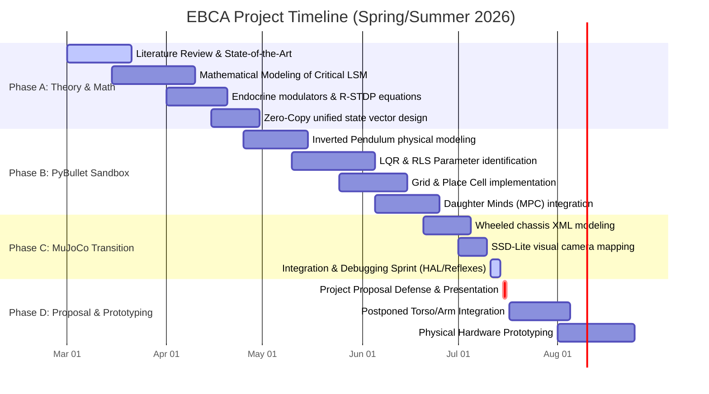

# ROADMAP: DIGITAL TWIN TO PHYSICAL HARDWARE
### Project Alignment: MuJoCo Simulation (Mini Project) & Real-World Hardware (Major Project)
**Document Reference:** `D:\ebca\docs\EVOLUTIONARY_ROADMAP.md`  
**Status:** Approved Architectural Blueprint  

---

## 1. PROJECT STRATEGY & MILESTONES

This document establishes the dual-phase roadmap for CARL's development, explicitly separating the simulated software validation from the physical hardware implementation:

1. **MINI PROJECT SUBMISSION: The Working Digital Twin (Simulation)**
   - **Deliverable:** A fully operational digital twin of CARL simulated in MuJoCo.
   - **Morphology (Phase I - Core):** Stable, high-efficiency wheeled differential-drive chassis (`D:\carl_simulation\world\carl_mujoco.xml`) to validate navigation, drives, and neuromodulation.
   - **Morphology (Phase II - Postponed 1-2 Weeks):** Integration of the 28-DOF torso and bilateral manipulation limbs for object interaction inside the simulation.
2. **MAJOR PROJECT SUBMISSION: The Real Hardware Robot (Physical)**
   - **Deliverable:** A physical robotic chassis implementing the exact same neuromodulatory and reservoir dynamics in the real world.

### 4.5-Month Evolutionary Gantt Chart


---


## 2. MORPHOLOGICAL PROGRESSION: CORE VS. POSTPONED

```
    MINI PROJECT CORE: MOBILE TWIN                  POSTPONED PHASE: MANIPULATION TWIN
         (MuJoCo Simulation)                             (MuJoCo Simulation)

            [ SENSORS ]                                     [ SENSORS ]
         (LiDAR / Battery)                               (LiDAR / IMU / Cam)
                │                                               │
          [ WHEELED BASE ]                                [ REAL CHASSIS ]
      (Differential Drive only)                       (Physical Wheeled Base)
                │                                               │
      (Virtual Exploration)                            [ PHYSICAL LIMBS ]
                                                      (Bilateral manipulation)
```

### Core Phase: Wheeled Digital Twin (Current Focus)
- **Morphology:** 4-wheeled differential drive base with exteroceptive LiDAR and metabolic battery simulation.
- **Cognitive Scope:** Closed-loop exteroceptive navigation, search optimization, endocrine state regulation (DA, NE, 5-HT, ACh), and spatial hazard avoidance using grid and place cells.
- **Scientific Goal:** Prove that the Liquid State Machine (LSM) reservoir brain can autonomously sustain its own existence (Autopoiesis) and adapt to coupled environmental constraints.

### Postponed Phase (1-2 Weeks): Manipulation Digital Twin
- **Morphology:** Integration of 28-DOF robot chassis incorporating a multi-joint flex spine, pan-tilt head, and dual 7-DOF arms ending in webbed grasping hands.
- **Cognitive Scope:** Hand-eye coordination, inverse kinematics (IK) neural mapping, active exteroceptive object tracking (YOLO/Camera), and tactile-feedback manipulation.

---

## 3. SCIENTIFIC & ENGINEERING JUSTIFICATION

### A. The Role of the Digital Twin (Mini Project)
Developing a high-fidelity digital twin in MuJoCo allows us to perform rapid, risk-free iteration on the cognitive substrate. We can test R-STDP learning, neuromodulatory baseline shifts, and constraint graphs without risk of physical actuator wear, battery hazards, or hardware collision damage. It serves as the mathematical and operational baseline for the real robot.

### B. Cognitive Isolation (Reducing Noise)
Introducing complex 28-DOF arm/hand kinematics in the simulation phase forces the brain to spend 90% of its resources on basic motor stability. By using the wheeled simulation for the core phase, we isolate the cognitive variables. We prove that the brain works in software before we introduce the noise and complexity of physical hardware and limbs.

### C. The 500-Neuron Biological Substrate
The reservoir brain is set to a fixed size of **exactly 500 neurons** for simulation and **250 neurons** for physical hardware:
- **Optimization:** Throttling Recursive Least Squares (RLS) updates to 5 Hz reduces CPU overhead by over 80% to keep execution lag-free on microcontrollers.
- **Holographic Dimension:** Projects sensory states into a **40,000-dimensional hypervector space** (`HDC`) for simulation, and **10,000 dimensions** for hardware. Bundling operations are strictly **event-driven (on place-cell transitions)** to eliminate redundant CPU ticks.
- **Cognitive Complexity:** We calculate the offline **Integration Index ($\phi_{\text{proxy}}$)** over a fixed structural partition to verify cooperative activity in the reservoir without Combinatorial search overhead.

### D. Zero-Copy Unified Memory Architecture
Adopting a unified memory scheme where all modules (sensors, LSM, endocrine system, and actuators) operate on reference views of a single, pre-allocated structured NumPy buffer. This eliminates data-copy latency, enables single-dump GIS state serialization, and replicates the speed and efficiency of modern system-on-chip unified architectures.

### E. Hardware Abstraction Layer (HAL) Decoupling
To ensure direct code portability, the brain interacts strictly with a generalized `HardwareInterface`. The simulation maps this interface to MuJoCo APIs, while the hardware robot maps it to serial and GPIO ports. This allows the core cognitive code to transfer from digital twin to physical robot with zero line changes.

---

## 4. FORMAL PRESENTATION DEFENSE

When defending the project structure to reviewers or examiners, utilize the following framing:

> **Reviewer Objection:** *"Why does the initial digital twin not implement the full primate arms and hands?"*
>
> **Response:**  
> *"Our project follows a structured engineering roadmap. The initial step focuses on validating the digital twin’s cognitive and biological brain (LSM, reflexes, endocrine chemistry, and constraint mapping) on a stable wheeled base to establish a verified baseline. The integration of 28-DOF manipulation limbs is scheduled for a postponed milestone in 1-2 weeks, followed by physical hardware transfer for the Major Project."*

---

## 5. NEXT CODEBASE STEPS

1. **Verify Simulated Physics:** Load `D:\carl_simulation\world\carl_mujoco.xml` inside `D:\ebca\carl_simulation.py`.
2. **LiDAR & Steering Binding:** Map the 24-ray LiDAR and differential torque outputs directly to the LSM reservoir readouts.
3. **Save Hardware Configs:** Maintain the Primate Scout model files (`GENESIS/carl_scout/*`) in the `archive/` or `future/` directories to serve as reference blueprints for the upcoming manipulation phase.


