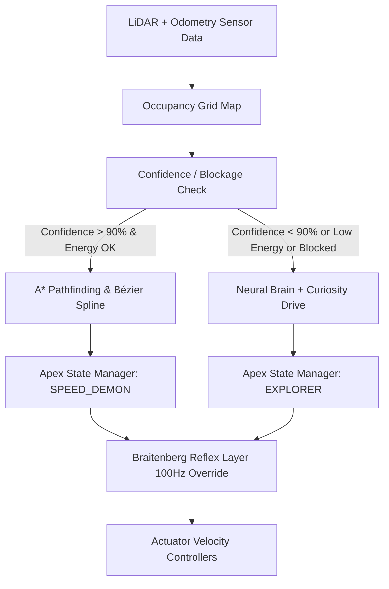

# Implementation Plan - Apex Agent Architecture (Dual-Mode Nervous System)

We will design and implement the **Apex Agent Architecture**, transitioning Bob from a purely reactive/neural Explorer into a persistent organism that maps his world, manages his energy, and executes optimal high-speed trajectories ("Speed Demon") when in known corridors, while retaining a robust safety fallback system.

## User Review Required

> [!IMPORTANT]
> **Key Architecture Decisions**
> 1. **Grid Resolution**: We propose a $50 \times 50$ occupancy grid spanning $[-4.5\text{m}, 4.5\text{m}]$, yielding a grid cell size of $0.18\text{m}$. This aligns with Bob's chassis diameter ($0.22\text{m}$) and allows precise detection of corridors and obstacles.
> 2. **Metabolism Scale**: Energy drain is calculated from the sum of absolute wheel torques. If `energy` falls below 20%, Bob enters *Economy Mode* (locks `SPEED_DEMON` mode and limits forward speed to $0.25\text{m/s}$).
> 3. **Curiosity Drive**: Intrinsic curiosity reward is scaled by the number of newly-mapped grid cells in a step, incentivizing exploration of unvisited sectors.
> 4. **Spatial Memory Cache**: Mapped occupancy grids will persist to `d:/carl_simulation/memory/map_cache.npz` and reload on start. Delete this file to force Bob to re-map.

---

## Open Questions

> [!WARNING]
> **Design Decisions & Ambiguity**
> - **Hazard Handling in Speed Run**: If the dynamic sliding hazard blocks the A* path, Bob should instantly fall back to `EXPLORER` mode. Do you want Bob to wait for the hazard to slide away, or should he actively recalculate a detour? (Our default implementation will fall back to Explorer, which naturally waits or navigates around).

---

## Proposed Changes

### 1. Mapping & Spatial Memory Cache

#### [NEW] [carl_mapping.py](file:///d:/carl_simulation/GENESIS/carl_mapping.py)
- Implement `OccupancyGrid` class:
  - Maintain a $50 \times 50$ grid representation of the arena.
  - Implement 2D Ray Casting (Bresenham-style) from Bob's current pose $(x, y, \theta)$ along the 24 LiDAR ray angles.
  - Clear rays up to the detected distance as unoccupied (`0`) and mark hits as occupied (`1`).
  - Track `visited` cells to calculate overall map coverage confidence: $\text{Confidence} = \frac{\text{visited cells}}{\text{total walkable cells}}$.
  - Implement `save(filepath)` and `load(filepath)` to write the map to disk (`map_cache.npz`).

---

### 2. Path Planning & Lookahead Follower

#### [NEW] [carl_planner.py](file:///d:/carl_simulation/GENESIS/carl_planner.py)
- Implement `AStarPlanner` class:
  - Find the shortest grid path between Bob's closest grid node and the food pellet.
  - Dilate walls in the grid map to create a collision-free safety margin.
- Implement `BézierSplineGenerator` class:
  - Smooth out sharp corners in the A* waypoint path into a differentiable curve using Bézier control points.
- Implement `PurePursuitFollower` class:
  - Output target forward and steering velocities $(v, \omega)$ to steer Bob toward a lookahead point on the spline.
  - Scale target speed dynamically: sprint straight corridors, slow down for sharp turns.

---

### 3. State Machine, Metabolism, & Curiosity Integration

#### [MODIFY] [carl_harvest.py](file:///d:/carl_simulation/GENESIS/carl_harvest.py)
- Integrate `OccupancyGrid`, `AStarPlanner`, and `PurePursuitFollower` into the simulation loop.
- **Metabolism**:
  - Add `energy` variable starting at `100.0`.
  - Drain energy each tick based on motor torques: $\Delta E = (|u_L| + |u_R|) \times \text{consumption\_rate}$.
  - Restore energy on harvesting food.
- **Curiosity**:
  - Add intrinsic reward: $R_{curiosity} = \text{new\_cells\_mapped} \times \text{curiosity\_weight}$.
  - Combine curiosity reward with food reward in neural policy observations.
- **Apex State Manager**:
  - Manage state transitions:
    - `EXPLORER`: Default state. Runs neural brain (`brain.step()`), updates map, consumes energy, accumulates curiosity.
    - `SPEED_DEMON`: High-speed state. Bypasses neural net; runs A* and Pure Pursuit path follower at max torque limits.
  - State Transition Rules:
    - Transition to `SPEED_DEMON` if map confidence $> 90\%$ (or loaded from cache) and `energy` $> 20\%$.
    - Fall back to `EXPLORER` if Braitenberg safety reflexes activate (collision imminent), the path is blocked, or `energy` $< 20\%$.

---

### 4. Safety Interrupts & Reflex Feedback

#### [MODIFY] [carl_brainstem.py](file:///d:/carl_simulation/GENESIS/carl_brainstem.py)
- Ensure Braitenberg safety reflex reports if an override occurred, enabling the state manager to immediately capture the interrupt.

---

## Verification Plan

### Automated Tests
- Check script syntax and unit functionality:
  `python -c "import carl_mapping, carl_planner; print('Imports operational!')"`
- Run the simulation:
  `python carl_harvest.py`

### Manual Verification
1. **Scouting Run**:
   - Delete `memory/map_cache.npz`.
   - Start the run. Bob should be in `EXPLORER` mode.
   - Observe him wandering the maze. Verify the printouts show map confidence increasing.
   - Verify the occupancy map periodically saves to `memory/map_cache.npz`.
2. **Speed Run**:
   - Once confidence reaches $> 90\%$, verify Bob flips state to `SPEED_DEMON`.
   - Check if he sprints along the smooth path at high speed.
   - Verify that the waddling biomimetic oscillation from the CPG is preserved.
3. **Reflex Fallback**:
   - Stand in Bob's path using keyboard overrides or let the sliding hazard block a junction.
   - Verify Bob drops to `EXPLORER` mode, backs out, and waits or searches for a detour.
4. **Metabolic Drain**:
   - Verify that if Bob's energy drops below 20%, he drops out of `SPEED_DEMON` and enters *Economy Mode*.
