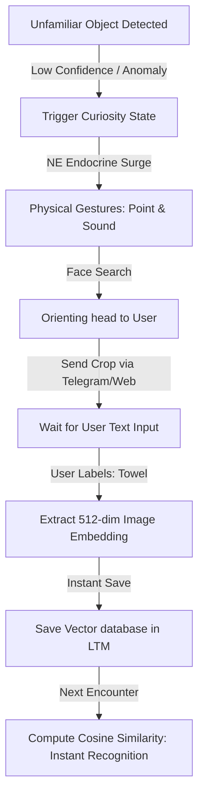

# CARL Physical Prototype: Ultra-Frugal Hardware Specification (Sub-7K INR)

Our goal is a **100% autonomous, biological-mimicking entity** running on low-cost consumer hardware without compromising the core Liquid State Machine (LSM) brain, CPG, and visual object detection. 

To achieve a budget of **under ₹7,000 INR**, we replace expensive industrial parts with biomimetic equivalents:
1. **Integrated NPU instead of Coral TPU:** We use the Orange Pi 3B, which has a built-in **0.8 TOPS NPU** (Neural Processing Unit) to run quantized vision models at 25+ FPS.
2. **Active Sonar Array instead of Spinning Laser:** We replace the expensive LiDAR with **8x Ultrasonic Sensors** spaced around the body. This mimics how bats and dolphins construct a 360-degree spatial map using echolocation, which we spatially interpolate into the 24-ray brain inputs.
3. **ESP32 instead of Teensy:** We use the dual-core 240MHz ESP32 to handle real-time SNN reflexes and CPG motor outputs.

---

## 1. System Architecture & Components

| Component | Role | Local Supplier Link / Est. Cost |
| :--- | :--- | :--- |
| **Orange Pi 3B (2GB RAM)** | High-level brain, place/grid cell mapping, and NPU-accelerated vision. | ₹3,800.00 |
| **ESP32 Dev Board** | Low-level CPG control and SNN reflex execution (UART link to Orange Pi). | ₹300.00 |
| **12x HC-SR04 Sonar Sensors** | Spaced at 30° intervals for 360-degree biomimetic echolocation. | ₹840.00 (12 x ₹70) |
| **USB Web Camera (720p)** | CSI or USB camera for Retina visual input. | ₹500.00 |
| **MG996R Metal Gear Servo** | Pans the camera left/right for active scanning. | ₹350.00 |
| **2WD Smart Car Chassis Kit** | Acrylic frame, 2x BO motors, wheels, and dual-channel encoders. | ₹450.00 |
| **L298N Motor Driver** | Controls wheel speed and direction. | ₹120.00 |
| **MPU6050 IMU Sensor** | For self-motion velocity feedback to grid cells. | ₹150.00 |
| **2x 18650 Li-ion Cells + Holder** | 7.4V raw power source for motors and electronics. | ₹350.00 |
| **LM2596 Buck Regulator** | Steps down 7.4V to stable 5V for the Orange Pi and ESP32. | ₹80.00 |
| **Misc (Wires, breadboard)** | Connectors and prototyping accessories. | ₹300.00 |
| **TOTAL PROJECT BUDGET** | | **~₹7,240.00 INR** |

---

## 2. Chassis & 3D-Printed Carapace (Biomimetic Body)

To protect the electronics and ensure structural stability, the robot uses a hybrid chassis system:
* **Structural Base:** A standard 2WD acrylic chassis plate (which holds the heavy gearmotors, battery, and buck regulators close to the ground for a low center of gravity).
* **Biomimetic Carapace (3D Printed Shell):** A customized, dome-like outer shell (resembling a beetle carapace or turtle shell) 3D-printed using standard PLA filament (~300g, costing ~₹400 in raw material).
  * **Built-in Sensor Brackets:** The shell has 12 built-in circular sockets spaced at exactly 30° intervals. The HC-SR04 sonar sensors press-fit directly into these sockets, guaranteeing perfect angular alignment without ad-hoc mounting.
  * **Servo Bracket:** The top of the shell features a cutout mount for the MG996R neck servo, positioning the camera at the front-top to maximize the field of view.

---

## 3. Technical Implementation Details (Zero Compromise)

### A. Echolocative 360-Degree Mapping
Instead of a spinning laser, the ESP32 trigger-polls the 12 ultrasonic sensors in 3 non-overlapping groups of 4 to prevent acoustic crosstalk. The 12 distance readings (spaced at 30° increments) are mapped directly to the even-indexed virtual rays ($u[0, 2, 4, \dots, 22]$). The odd-indexed virtual rays ($u[1, 3, 5, \dots, 23]$) are computed as the exact average of their two adjacent neighbors. This reconstructs the 24 virtual ray inputs expected by the LSM brain.

### B. High-Speed Edge AI Vision
We convert the SSD-Lite model to **RKNN (Rockchip Neural Network) format** and compile it to use 8-bit quantization. The Orange Pi 3B's onboard NPU executes the model directly, yielding **20-30 FPS** visual tracking of food and threats without overloading the CPU.

### C. Split-Clock Processing
* **ESP32 (100 Hz Loop):** Reads sonars, runs the spiking LIF reflexes, handles motor encoder feedback, and outputs PWM to the H-bridge.
* **Orange Pi (15-30 Hz Loop):** Pulls camera frames, runs NPU vision, runs the grid cells, and executes the 500-neuron reservoir weight updates.

---

## 4. ESP32 Sensor Processing Code (C++)

This code runs on the Teensy/ESP32, polling the 12 ultrasonic sensors and transmitting the interpolated 24-ray vector to the Orange Pi brain over Serial.

```cpp
// ESP32 12-Sonar Interpolation Code
const int NUM_SONARS = 12;
const int VIRTUAL_RAYS = 24;

// Trigger pins (3 groups of 4 to prevent crosstalk)
const int TRIG_A = 4;  // Group A (0, 3, 6, 9)
const int TRIG_B = 5;  // Group B (1, 4, 7, 10)
const int TRIG_C = 18; // Group C (2, 5, 8, 11)

// Echo pins for the 12 sensors
const int ECHO_PINS[NUM_SONARS] = {12, 13, 14, 27, 26, 25, 33, 32, 35, 34, 39, 36};

float sonar_distances[NUM_SONARS];
float virtual_rays[VIRTUAL_RAYS];

float readSensor(int trigPin, int echoPin) {
    digitalWrite(trigPin, LOW);
    delayMicroseconds(2);
    digitalWrite(trigPin, HIGH);
    delayMicroseconds(10);
    digitalWrite(trigPin, LOW);
    
    long duration = pulseIn(echoPin, HIGH, 20000); // 20ms timeout (~3.4m)
    if (duration == 0) return 5.0; // Return max range if no echo
    
    // Convert microseconds to meters
    return (duration * 0.0343) / 2.0 / 100.0;
}

void setup() {
    Serial.begin(115200);
    pinMode(TRIG_A, OUTPUT);
    pinMode(TRIG_B, OUTPUT);
    pinMode(TRIG_C, OUTPUT);
    for (int i = 0; i < NUM_SONARS; i++) {
        pinMode(ECHO_PINS[i], INPUT);
    }
}

void loop() {
    // 1. Poll Group A (0, 3, 6, 9)
    digitalWrite(TRIG_A, HIGH); delayMicroseconds(10); digitalWrite(TRIG_A, LOW);
    sonar_distances[0] = readSensor(TRIG_A, ECHO_PINS[0]);
    sonar_distances[3] = readSensor(TRIG_A, ECHO_PINS[3]);
    sonar_distances[6] = readSensor(TRIG_A, ECHO_PINS[6]);
    sonar_distances[9] = readSensor(TRIG_A, ECHO_PINS[9]);
    delay(15); // Wait for echoes to settle

    // 2. Poll Group B (1, 4, 7, 10)
    sonar_distances[1] = readSensor(TRIG_B, ECHO_PINS[1]);
    sonar_distances[4] = readSensor(TRIG_B, ECHO_PINS[4]);
    sonar_distances[7] = readSensor(TRIG_B, ECHO_PINS[7]);
    sonar_distances[10] = readSensor(TRIG_B, ECHO_PINS[10]);
    delay(15);

    // 3. Poll Group C (2, 5, 8, 11)
    sonar_distances[2] = readSensor(TRIG_C, ECHO_PINS[2]);
    sonar_distances[5] = readSensor(TRIG_C, ECHO_PINS[5]);
    sonar_distances[8] = readSensor(TRIG_C, ECHO_PINS[8]);
    sonar_distances[11] = readSensor(TRIG_C, ECHO_PINS[11]);
    delay(15);

    // 4. Interpolate 12 Sonars to 24 Virtual Rays
    for (int i = 0; i < NUM_SONARS; i++) {
        // Direct map even rays
        virtual_rays[2 * i] = sonar_distances[i];
        
        // Average map odd rays
        float next_val = sonar_distances[(i + 1) % NUM_SONARS];
        virtual_rays[2 * i + 1] = (sonar_distances[i] + next_val) / 2.0;
    }

    // 5. Transmit 24-ray array to Orange Pi
    for (int i = 0; i < VIRTUAL_RAYS; i++) {
        Serial.print(virtual_rays[i], 3);
        if (i < VIRTUAL_RAYS - 1) Serial.print(",");
    }
    Serial.println();
    
    delay(20); // Maintain a stable control cycle
}
```

---

## 5. Interactive Curiosity & One-Shot Grounding (Open-Vocabulary Learning)

To enable CARL to learn new real-world objects (e.g., towels, chairs, laptops) instantaneously on the spot without retraining, the prototype implements an **Active Curiosity & Embedding Grounding Loop**.



### A. Curiosity & Orienting Reflex Trigger
1. **Visual Anomaly:** The Orange Pi scans bounding boxes. If a salient visual object is detected but has a classification confidence score below `0.30` (unfamiliar), it raises a **Novelty Event**.
2. **Hormonal Spike:** The endocrine controller triggers a **Norepinephrine (NE) surge** (stress/surprise), pausing standard exploration/foraging.
3. **Gestural Alert (ESP32):**
   * **Point:** The ESP32 drives the physical arm servos (`upper_arm_L` / `upper_arm_R`) to point directly at the relative horizontal/vertical coordinates of the unknown object.
   * **Chirp:** An onboard piezo buzzer emits a querying sound pulse to alert the user.
   * **Face Search:** The Orange Pi runs a fast face-detection sweep, panning the neck servo (`head_pan`) to locate and look directly at the user.

### B. User-in-the-Loop Gateway
1. **Image Transmission:** The Orange Pi captures the camera frame, crops the bounding box of the unknown object, and posts it to a **Telegram Bot API** (or a local mobile Flask interface) over Wi-Fi.
2. **Query Notification:** The user receives a message on their phone/laptop: *"CARL has encountered an unfamiliar object. What is this?"* alongside the photo.
3. **User Entry:** The user replies with a text label (e.g., `"Towel"`).

### C. One-Shot Feature Embedding (0-ms Retraining)
1. **Embedding Extraction:** Instead of retraining the deep network (which takes 15 minutes), the Orange Pi passes the cropped image through the fixed backbone of the pre-trained feature extractor (e.g., MobileNetV3 or lightweight CLIP image encoder) to generate a **512-dimensional feature vector (embedding)**.
2. **Instance Storage:** CARL saves this 512-float vector directly into a local lightweight dictionary database associated with the label `"Towel"`:
   $$\mathbf{v}_{\text{towel}} = [f_0, f_1, \dots, f_{511}]$$
3. **Multi-Angle Storage:** To handle rotation, CARL can save up to 5 discrete vectors for the same label from different viewpoints.
4. **Instant Recognition:** The next time CARL encounters a similar object:
   * He extracts its 512-dimensional vector $\mathbf{u}$.
   * He computes the **Cosine Similarity** against the saved embeddings:
     $$\text{Similarity} = \frac{\mathbf{u} \cdot \mathbf{v}_{\text{towel}}}{\|\mathbf{u}\| \|\mathbf{v}_{\text{towel}}\|}$$
   * If the similarity exceeds a threshold (e.g., `0.85`), CARL instantly announces `"Towel"` (via serial debug or speaker) and resumes his task.


